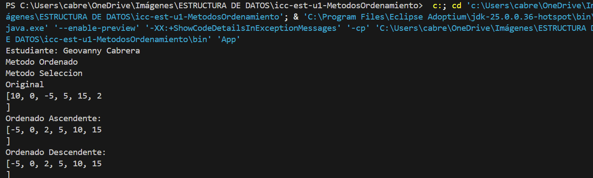
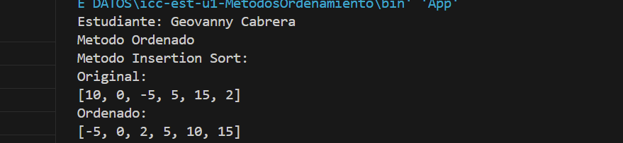
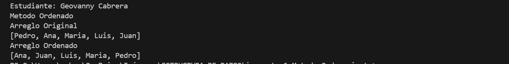
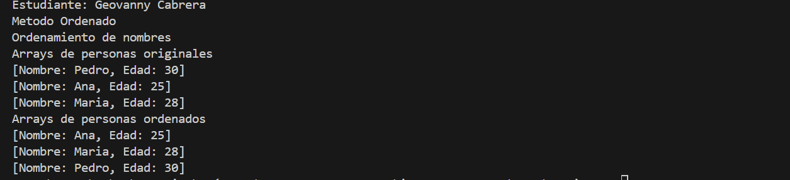
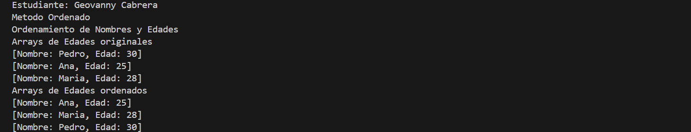

# Estructura de datos

**Estudiante** Geovanny Cabrera

## Metodos Ordenamiento

### Practica 1 - 20/OCTUBRE
Metodo Sort Bubble

### Practica 2 - 21/OCTUBRE
Metodo Sort Selecction en Java Y Python

Salida de Python

Salida de Java

### Practica 3 - 23/OCTUBRE
## Insertion Sort
Salida de Java 
## Arreglo de numeros Enteros

## Arreglo de cadena
Salida de Java

## Arreglo de Personas Ordenado por Nombre
Salida de Java

## Arreglo de Personas Ordenado por Edades
Salida de Java

