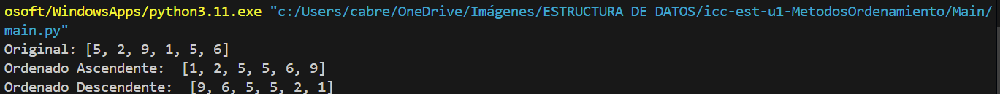

# Estructura de datos

**Estudiante** Geovanny Cabrera

## Metodos Ordenamiento

### Practica 1 - 20/OCTUBRE
Metodo Sort Bubble

### Practica 2 - 21/OCTUBRE
Metodo Sort Selecction en Java Y Python

Salida de Python

